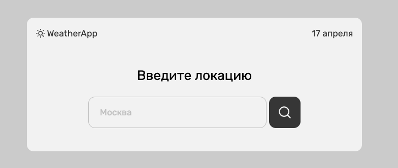
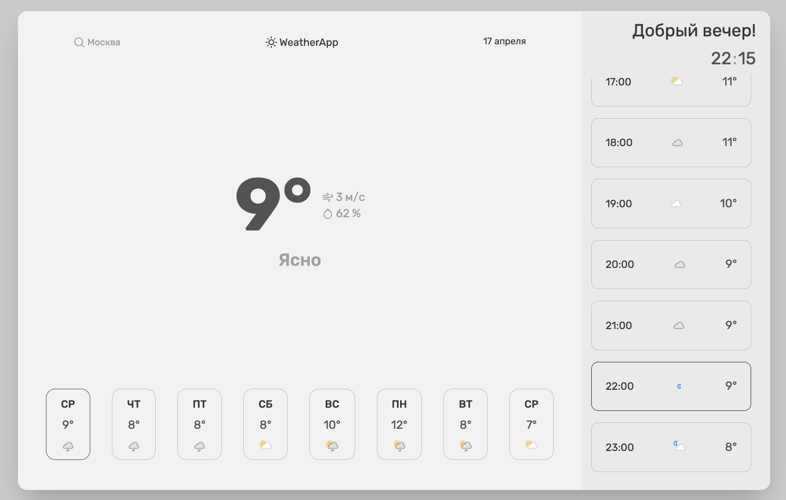

# WeatherApp




## .env

| NEXT_PUBLIC_WEATHER_TOKEN | Token from [WeatherApi](https://www.weatherapi.com/) |
| ------------------------- | ---------------------------------------------------- |

## Start

### Production

NPM:

```bash
npm run build
npm run start
```

YARN:

```bash
yarn build
yarn start
```

### Development

NPM:

```bash
npm run dev
```

YARN:

```bash
yarn dev
```
